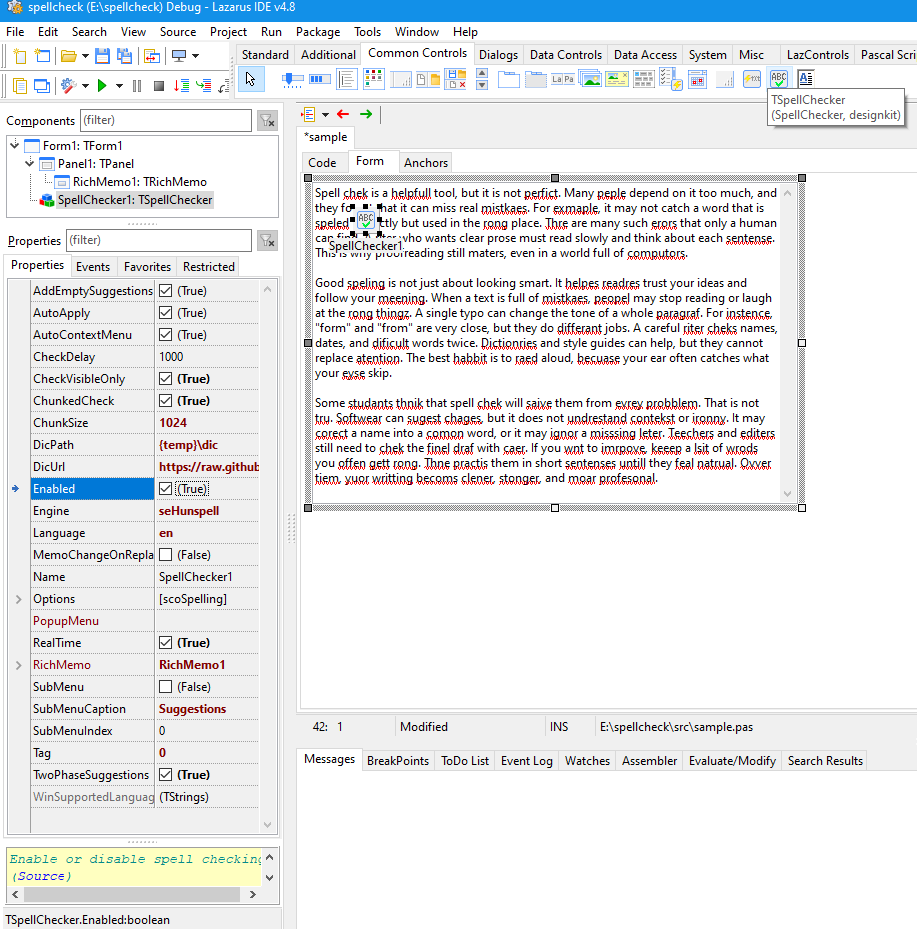

# SpellCheck — TSpellChecker Usage Example

This repository contains a minimal Lazarus/FPC project that demonstrates how to add spell checking to a `TRichMemo` control using the non-visual `TSpellChecker` component from the [DesignKit](https://github.com/plainlib/designkit) package.



The project is not part of DesignKit — it is a simple integration example. The component supports two engines: the native Windows Spell Checker (`seWindows`) and the cross-platform Hunspell engine (`seHunspell`).

## What This Example Demonstrates

- Placing a `TSpellChecker` component on a form.
- Binding the component to a `TRichMemo` via the `RichMemo` property.
- Automatic underlining of spelling errors.
- A context menu with replacement suggestions on right-click.
- Real-time checking with a debounce delay (`RealTime`, `CheckDelay`).
- Using Hunspell on Windows, Linux, and macOS.

## How `TSpellChecker` Works

`TSpellChecker` is a non-visual component available on the **Common Controls** tab of the Lazarus component palette. It does not replace `TRichMemo`; instead, it manages text checking through the `RichMemo` property.

Main properties:

| Property | Purpose |
|---|---|
| `RichMemo` | The `TRichMemo` control to spell-check. |
| `Language` | BCP-47 language tag, e.g. `en-US`, `ru-RU`. |
| `Enabled` | Enables or disables spell checking. |
| `Options` | A set of `TSpellCheckOptions`. |
| `RealTime` | Check text after changes. |
| `CheckDelay` | Delay before checking after the last change. |
| `AutoApply` | Automatically apply error underlines. |
| `AutoContextMenu` | Automatically show the suggestion menu. |
| `PopupMenu` | External `TPopupMenu` for integrating suggestions. |
| `Engine` | Engine: `seWindows` or `seHunspell`. |
| `DicPath` | Directory containing Hunspell dictionaries. |
| `DicUrl` | URL template for automatic dictionary download. |

Events:

- `OnSpellCheckComplete` — fired after a check finishes; reports the number of errors.
- `OnContextPopup` — allows custom handling of the context menu.

Typical flow:

1. Assign `TSpellChecker.RichMemo`.
2. Set `Language`.
3. Choose `Engine`.
4. With `RealTime := True`, checking runs after text changes with a `CheckDelay`.
5. With `AutoApply := True`, errors are underlined in `TRichMemo`.
6. With `AutoContextMenu := True`, right-clicking a misspelled word shows a suggestion menu.
7. For Hunspell, also set `DicPath` and/or `DicUrl`.

## Example Source Code

The main form unit looks like this:

```pascal
unit sample;

{$mode objfpc}{$H+}

interface

uses
  Classes, SysUtils, Forms, Controls, Graphics, Dialogs, RichMemo, SpellChecker;

type

  { TForm1 }

  TForm1 = class(TForm)
    RichMemo1: TRichMemo;
    SpellChecker1: TSpellChecker;
  private

  public

  end;

var
  Form1: TForm1;

implementation

{$R *.lfm}

end.
```

The form contains:

- `TRichMemo` — a rich text editing control.
- `TSpellChecker` — the non-visual spell-checking component.

The main `SpellChecker1` properties are set in `spellcheck.lfm` or in the Object Inspector: `RichMemo`, `Language`, `Engine`, `RealTime`, `AutoApply`, `AutoContextMenu`, and others.

## Directory Structure

```text
spellcheck/
├─ .gitignore              # Git ignore rules
├─ .gitmodules             # Git submodule definitions for dependencies
├─ build.cmd               # Main project build script
├─ build32.cmd             # Wrapper for 32-bit build
├─ CONTRIBUTING.md         # Contribution guidelines
├─ depadd.cmd              # Helper script to add a dependency
├─ dependencies.cmd        # Builds all project dependencies
├─ dependencies32.cmd      # Builds dependencies for 32-bit target
├─ dependency.cmd          # Universal single-dependency builder
├─ depsbinary.cmd          # Copies and signs binary files
├─ depssub.cmd             # Pulls latest dependency submodule sources for x64 without building them
├─ fast.cmd                # Quick project build: skips dependencies, signing, and binary processing
├─ lib/                    # Compiled modules/libraries
├─ libs/                   # Git submodules (Helpers, Toolkit, RichMemo, RichKit, DesignKit)
├─ LICENSE                 # License file
├─ makefile                # Alternative make-based build
├─ samples/                # Additional samples
├─ spellcheck.ico          # Application icon
├─ spellcheck.lpi          # Lazarus project file
├─ spellcheck.lpr          # Main project source
├─ spellcheck.lps          # Local Lazarus project settings
├─ spellcheck.res          # Application resources
├─ src/                    # Example source code
└─ tar.cmd                 # Packaging/archive helper script
```

The `libs/` directory contains dependencies connected as Git submodules. The `src/` directory contains the example sources, including `sample.pas`. The `samples/` directory may contain additional examples.

## Building

### Requirements

- Lazarus 4.8 or newer.
- Free Pascal Compiler 3.2.2 or newer.
- LCL.
- For `seWindows`: Windows 8 or newer.
- For `seHunspell`: Hunspell dictionaries (`.aff` + `.dic`).

Dependencies:

- [RichMemoPackage](https://github.com/plainlib/richmemo)
- [Helpers](https://github.com/plainlib/helpers)
- [Toolkit](https://github.com/plainlib/toolkit)
- [RichKit](https://github.com/plainlib/richkit)
- [DesignKit](https://github.com/plainlib/designkit)

They are included via `libs/` and `.gitmodules`.

### Using Lazarus

1. Open `spellcheck.lpi`.
2. Select a build mode, e.g. `Release`.
3. Click **Build**.

### Using Scripts

```cmd
build.cmd
```

Builds the 64-bit version.

```cmd
build.cmd 32
```

Builds the 32-bit version.

Additional `build.cmd` options:

- `--no-deps` — skip dependency build.
- `--no-build` — skip project build.
- `--no-sign` — skip executable signing.
- `--no-binary` — skip binary file processing.

The `dependencies.cmd` script builds dependencies: Helpers, Toolkit, RichMemo, RichKit, DesignKit. The `dependency.cmd` script is a universal builder for a single dependency via `lazbuild`.

## License

All components and dependencies used in this example are distributed under the MIT License.  
See the `LICENSE` file for details.