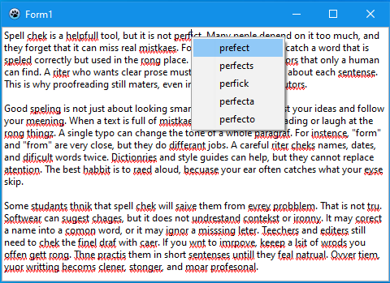

# SpellCheck — TSpellChecker Usage Example

[](https://opensource.org/licenses/MIT)
[](https://www.lazarus-ide.org/)
[](#)
[](https://github.com/plaintool/spellcheck/releases/latest)

This repository contains a minimal Lazarus/FPC project that demonstrates how to add spell checking to a `TRichMemo` control using the non-visual `TSpellChecker` component from the [DesignKit](https://github.com/plainlib/designkit) package.


The project is not part of DesignKit — it is a simple integration example. The component supports two engines: the native Windows Spell Checker (`seWindows`) and the cross-platform Hunspell engine (`seHunspell`).

## What This Example Demonstrates

- Placing a `TSpellChecker` component on a form.
- Binding the component to a `TRichMemo` via the `RichMemo` property.
- Automatic underlining of spelling errors.
- A context menu with replacement suggestions on right-click.
- Real-time checking with a debounce delay (`RealTime`, `CheckDelay`).

## How `TSpellChecker` Works

`TSpellChecker` is a non-visual component available on the **Common Controls** tab of the Lazarus component palette. It does not replace `TRichMemo`; instead, it manages text checking through the `RichMemo` property.

Main properties:

| Property | Purpose |
|---|---|
| `RichMemo` | The `TRichMemo` control to spell-check. |
| `Language` | BCP-47 language tag, e.g. `en-US`, `ru-RU`. |
| `Enabled` | Enables or disables spell checking. |
| `Options` | A set of `TSpellCheckOptions`. |
| `AddEmptySuggestions` | Include errors that have no suggestions. Default is `True`. |
| `RealTime` | Check text after changes. |
| `CheckDelay` | Delay before checking after the last change. |
| `AutoApply` | Automatically apply error underlines. |
| `AutoContextMenu` | Automatically show the suggestion menu. |
| `MemoChangeOnReplace` | When `True`, `RichMemo.OnChange` fires for replacements from the suggestion menu. Default is `False`. |
| `PopupMenu` | External `TPopupMenu` for integrating suggestions. |
| `SubMenu` | When `True`, suggestions are placed in a submenu. Default is `False`. |
| `SubMenuCaption` | Caption of the submenu when `SubMenu` is `True`. Default is `Suggestions`. |
| `SubMenuIndex` | Index where suggestions or the submenu are inserted in `PopupMenu`. Default is `0`. |
| `Engine` | Engine: `seWindows` or `seHunspell`. |
| `DicPath` | Hunspell dictionaries directory; also a cache for downloads via `DicUrl`. |
| `DicUrl` | URL template for automatic dictionary download. |
| `ChunkedCheck` | When `True`, large texts are checked in chunks and underlines are drawn incrementally, starting from the visible area. |
| `ChunkSize` | Size of one chunk in bytes when `ChunkedCheck` is enabled. Default is `16384`. |
| `CheckVisibleOnly` | When `True`, only the visible part of the RichMemo is checked and re-checked on scroll. Default is `False`. |
| `TwoPhaseSuggestions` | When `True`, the check runs in two passes: first errors and underlines, then background suggestion generation. Hunspell engine only. Default is `False`. |
| `WinSupportedLanguages` | Read-only list of BCP-47 tags supported by the current engine. Empty for the Hunspell engine. |

Events:

| Event | Purpose |
|---|---|
| `OnContextPopup` | Fired before the component's built-in handling. Set `Handled := True` to suppress the automatic suggestion menu and show your own. |
| `OnReplace` | Fired right after a suggestion replaced a word. Useful because `RichMemo.OnChange` is suppressed during replacement. |
| `OnSpellCheckComplete` | Fired after each check, including the automatic re-check that follows a replacement. |

Typical flow:

1. Assign `TSpellChecker.RichMemo`.
2. Set `Language`.
3. Choose `Engine`.
4. With `RealTime := True`, checking runs after text changes with a `CheckDelay`.
5. With `AutoApply := True`, errors are underlined in `TRichMemo`.
6. With `AutoContextMenu := True`, right-clicking a misspelled word shows a suggestion menu.
7. For Hunspell, also set `DicPath` and/or `DicUrl`.

## Context Menu with Suggestions



When `AutoContextMenu` is `True` (the default), `TSpellChecker` hooks the
`OnContextPopup` event of the assigned `TRichMemo`. Right-clicking a
misspelled word opens a menu with suggestions produced by the active
engine. Choosing a suggestion replaces the word in the memo and triggers
a fresh check automatically.

The menu can be customised with the following properties:

| Property | Default | Purpose |
|---|---|---|
| `AutoContextMenu` | `True` | Automatically show the suggestion menu on right-click. When `False`, no menu is shown by the component; the original `OnContextPopup` handler (if any) still runs. |
| `PopupMenu` | `nil` | An external `TPopupMenu` to integrate suggestions into. When `nil`, the component builds its own menu. When set, suggestions are inserted into this menu at `SubMenuIndex`. |
| `SubMenu` | `False` | If `True`, suggestions are placed inside a submenu instead of being inserted directly into `PopupMenu`. |
| `SubMenuCaption` | `'Suggestions'` | Caption of the submenu when `SubMenu` is `True`. |
| `SubMenuIndex` | `0` | Index in `PopupMenu` where the suggestions (or the submenu) are inserted. |

Notes:

- If the right-click lands on a correctly spelled word, the component
  does not show its own menu and falls back to `RichMemo.PopupMenu`
  (if one is assigned).
- If `PopupMenu` is assigned but the right-click is not on an error,
  the external menu is still shown, so you can mix your own items with
  spelling suggestions.
- Replacing a word via the menu sets `MemoChangeOnReplace` behavior:
  when `False` (default), `RichMemo.OnChange` is suppressed during the
  replacement; the component then starts a new check by itself.
  Set `MemoChangeOnReplace := True` if you want `OnChange` to fire for
  the replacement as well.

## Spell Engines

`TSpellChecker` supports two independent engines, selected via the `Engine`
property. Both expose the same interface through `TRichSpellChecker`, so
switching between them does not require any changes in your code.

### `seWindows` — Windows Spell Checker

Wraps the native Windows Spell Check API available since Windows 8. The unit
`WinSpellChecker` declares the COM interfaces (`ISpellCheckerFactory`,
`ISpellChecker`, `IEnumSpellingError`, `ISpellingError`) directly in Object
Pascal, without importing a type library.

Highlights:

- Uses the spell checker installed in the operating system.
- Supports BCP-47 language tags, with automatic normalisation of short codes
  (for example `en` → `en-US`, `pt` → `pt-BR`).
- Supports two check modes: `scoSpelling` (plain spelling) and
  `scoComprehensiveSpelling` (grammar and style, availability depends on the
  installed language pack).
- Provides suggestions and the full list of supported languages.
- Windows-only.

### `seHunspell` — Hunspell (cross-platform)

A pure Object Pascal implementation of the Hunspell engine in the unit
`HunSpellChecker`. It works on Windows, Linux and macOS and does not rely on
any external library or DLL.

Highlights:

- Loads standard Hunspell dictionaries (`.aff` + `.dic`) from files or
  streams, including the ability to auto-download them from a URL.
- Supports affix rules (prefixes and suffixes), continuation flags,
  compounding (`COMPOUNDFLAG`, `COMPOUNDRULE`, `COMPOUNDMIN`,
  `CHECKCOMPOUNDDUP`, `CHECKCOMPOUNDPATTERN` and related directives),
  `BREAK` patterns, `REP` and `MAP` tables, `ICONV`/`OCONV` conversions and
  the `IGNORE` directive.
- Handles multiple flag encodings (`ASCII`, `UTF-8`, `long`, `num`) and
  several source encodings declared by `SET` in the `.aff` file.
- Suggestion generation follows Hunspell's approach: `REP` and `MAP` rules,
  `TRY` and `KEY` substitutions, edit operations, and a Levenshtein scan
  over the dictionary limited to the likely length band.

### Notes on Both Engines

Both engines are written from scratch in Object Pascal and ship with the
package; no third-party library, COM type library or native binding is
required beyond what is already present in FPC and the LCL.

The **Hunspell** engine covers the features that are required for the
dictionaries used in practice, but it is not a byte-for-byte reproduction
of the reference C++ implementation. Complex edge cases may behave
differently or be handled less precisely.

The **Windows** engine calls the real Windows Spell Check API directly, so
the errors, their positions and their suggestions come straight from the OS.
The only thing that is computed locally is the error category: since the
Windows API does not label an error as "spelling" or "comprehensive", the
engine runs both `Check` and `ComprehensiveCheck` and classifies an error as
`setSpelling` when it appears in both lists, and as
`setComprehensiveSpelling` when it appears only in the comprehensive list.
A plain `scoSpelling` check is therefore identical to what Windows itself
reports, while the split between spelling and comprehensive errors is a
close approximation.

## Directory Structure

```text
spellcheck/
├─ libs/                   # Git submodules (Helpers, Toolkit, RichMemo, RichKit, DesignKit)
├─ lib/                    # Compiled modules/libraries
├─ samples/                # Additional samples
├─ src/                    # Example source code
├─ .gitignore              # Git ignore rules
├─ .gitmodules             # Git submodule definitions for dependencies
├─ build.cmd               # Main project build script
├─ build32.cmd             # Wrapper that calls build.cmd with the 32-bit target
├─ buildfast.cmd           # Quick project build: skips dependencies, signing, and binary processing
├─ CONTRIBUTING.md         # Contribution guidelines
├─ depadd.cmd              # Helper script to add a dependency
├─ dependencies.cmd        # Builds all project dependencies
├─ dependencies32.cmd      # Builds dependencies for 32-bit target
├─ dependency.cmd          # Universal single-dependency builder
├─ depsbinary.cmd          # Copies and signs binary files
├─ depspull.cmd            # Pulls latest dependency submodule sources for x64 without building them
├─ LICENSE                 # License file
├─ makefile                # Alternative make-based build
├─ spellcheck.ico          # Application icon
├─ spellcheck.lpi          # Lazarus project file
├─ spellcheck.lpr          # Main project source
├─ spellcheck.lps          # Local Lazarus project settings
├─ spellcheck.res          # Application resources
└─ tar.cmd                 # Packaging/archive helper script
```

The `libs/` directory contains dependencies connected as Git submodules. The `src/` directory contains the example sources, including `sample.pas`. The `samples/` directory may contain additional examples.

## Building

### Requirements

- Lazarus 4.8 or newer.
- Free Pascal Compiler 3.2.2 or newer.
- LCL.
- For `seWindows`: Windows 8 or newer.
- For `seHunspell`: Hunspell dictionaries (`.aff` + `.dic`).

Dependencies:

- [RichMemoPackage](https://github.com/plainlib/richmemo)
- [Helpers](https://github.com/plainlib/helpers)
- [Toolkit](https://github.com/plainlib/toolkit)
- [RichKit](https://github.com/plainlib/richkit)
- [DesignKit](https://github.com/plainlib/designkit)

They are included via `libs/` and `.gitmodules`.

### Using Scripts

All `.cmd` scripts in this repository are Windows-only.

```cmd
build.cmd
```

Builds the 64-bit version.

```cmd
build32.cmd
```

Equivalent to `build.cmd 32`. Builds the 32-bit version.

Additional `build.cmd` options:

- `--no-deps` — skip dependency build.
- `--no-build` — skip project build.
- `--no-sign` — skip executable signing.
- `--no-binary` — skip binary file processing.

The `dependencies.cmd` script builds dependencies: Helpers, Toolkit, RichMemo, RichKit, DesignKit. The `dependency.cmd` script is a universal builder for a single dependency via `lazbuild`.

### Building on Linux / macOS

The `.cmd` scripts are Windows-only. On Linux and macOS, use the provided `makefile`:

```bash
make
```

The makefile pulls the submodules and builds all dependencies
(Helpers, Toolkit, RichMemo, RichKit, DesignKit) before building the project
itself, so a clean checkout can be built with a single command.

### Using Lazarus

Before opening the project, make sure the dependency submodules in `libs/`
are checked out:

```bash
git submodule update --init --recursive
```

If you open the project directly in the Lazarus IDE, the packages from the
`libs/` folder are not built automatically. You need to install them first:

1. Open the package file (`designkit.lpk`) in Lazarus and click
   **Use → Install**, then rebuild the IDE. This pulls in the whole dependency
   chain (Helpers, Toolkit, RichMemo, RichKit, DesignKit).
2. Open `spellcheck.lpi`.
3. Select a build mode, e.g. `Release`.
4. Click **Build**.

If you don't want to install packages into the IDE, use the Windows batch
scripts `build` or `make` instead — they build everything through `lazbuild` without
touching your IDE installation.

## License

All components and dependencies used in this example are distributed under the MIT License.
See the `LICENSE` file for details.